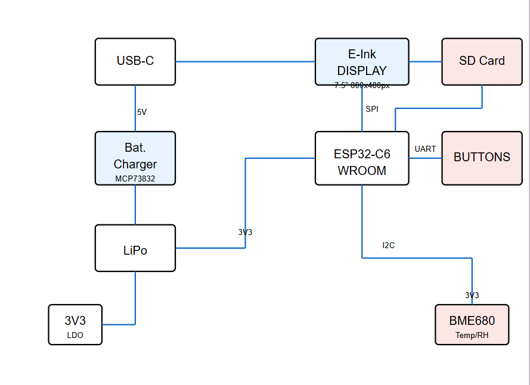

# Proiect-TSC 
Tulumb Radu Cristian 332CB
e-book reader

Procesul de dezvoltare
In prima parte a proiectului cand am realizat schematicul m-am folosit de descrierea pieselor din pdf-ul de pe OCW pentru a denumi, aranja si a da valori componentelor. Am schimbat de fiecare data layerul cand ba puneam nets ba symbols ba lines. M-am folosit de toolurile necesare pentru a schimba numele si valorile pieselor apoi am dat switch in PCB.
In PCB am tinut cont de masuratorile de pe OCW si de pozitia componentelor. Ca sa ma asigur ca dimensiunea placutei este corecta am modificat gridul PCB-ului in 1 mm cu 1 mm pentru a determina daca este dimensiunea corecta. Rutarea a fost mai complicata, dar am reusit sa o fac pe layerul de top si bottom. Mai aveam doua erori hole carora le-am dat approve. Pentru a continua am dat switch in PCB3D.
Am cautat piesele individual folosind design manager si sintaxa (ObjectType = Device) AND (Name = "piesa respectiva") pentru a cauta piesa pentru care urma sa fac un model 3D. Modelele 3D au fost luate de pe SnapMagic, Mouser, SnapEDA si componentsearchengine unde am gasit modelele 3D pentru fiecare piesa in parte. Am creat un fisier special cu toate modelele 3D necesare, le-am rotit si ajustat pentru a se incadra in linia punctata verde si intre cele doua puncte verzi si i-am dat replace package apoi am salvat, am dat in PCB update apoi cand dadeam switch to PCB3D imi punea piesa pe placuta. Pentru TP-uri am desenat un cerc.
Pentru generarea fisierelor Gerber am folosit optiunea de Fabrication Outputs din meniul MANUFACTURE din Fusion 360. Am selectat toate straturile necesare (Top Copper, Bottom Copper, Top Mask, Bottom Mask, Top Paste, Bottom Paste, Top Silkscreen, Bottom Silkscreen si Edge Cuts) si am generat fisierele in formatul cerut.
Am generat fisierul BOM (Bill of Materials) utilizand functionalitatea din meniul MANAGE, selectand toate componentele folosite in proiect si exportand in formatul CSV, apoi l-am salvat in directorul Manufacturing.
Fisierul Pick and Place (CPL) a fost generat din meniul MANUFACTURE, sectiunea Assembly, selectand optiunile pentru coordonatele componentelor si formatand corespunzator pentru productie.
Probleme la implementare
Aprobarea erorilor
La rutarea PCB-ului a fost nevoie sa aprob 2 erori de "hole" cauzate de componentele SMD.
Lipsa model 3D
Pentru TP-uri nu am gasit un model 3D, asa ca am facut un cerc pe care l-am ridicat putin.

[(BOM)](Manufacturing/BOM_proiect2025%20v19.csv)

## Functionalitatile Hardware
Acest e-book reader foloseste un microcontroller ESP32-C6 WROOM care controleaza un display e-ink de 1.5" cu rezolutie 200x200px. Dispozitivul include urmatoarele componente principale:

Componente Hardware Utilizate

ESP32-C6: Microcontroller principal pentru procesarea datelor si conectivitate.

E-Paper Display: Display cu consum redus de energie, conectat prin SPI.

Conectori pentru SD Card: Permite stocarea suplimentara a cartilor electronice.

Memorie NOR Flash 64MB: Stocare suplimentara pentru fisiere tip e-book.

Baterie Li-Po: Sursa principala de alimentare a dispozitivului.

Conector USB-C: Permite incarcarea si transferul de date.

Modul RTC DS3231SN: Functionalitate de ceas in timp real.

Senzor de Mediu BME680: Monitorizeaza parametrii de mediu prin I2C.

Senzor CO2 MH-Z19B: Masoara nivelul de CO2 prin UART.

Senzor particule PMSA003: Detecteaza particule fine prin UART.

MAX17048G: Circuit de management pentru baterie.

Interfete Principale

SPI: Utilizata pentru E-Paper display si memoria Flash.

I2C: Conecteaza senzorul BME680 si modulul RTC.

UART: Folosita pentru comunicatie cu senzorii PMSA003 si MH-Z19B.

GPIO: Utilizati pentru butoane si alte componente periferice.

Pini Utilizati - ESP32-C6

GPIO18, GPIO19: SCK si MISO pentru interfata SPI.

GPIO5: Chip Select pentru memoria Flash.

GPIO4: Reset pentru E-Paper.

GPIO22: SCL pentru interfata I2C.

GPIO21: SDA pentru interfata I2C.

GPIO16: TX pentru comunicatie seriala.

GPIO17: RX pentru comunicatie seriala.

GPIO20, GPIO21, GPIO22: Conectati la butoanele de control.

GPIO10: Chip Select pentru cardul SD.

GPIO1: MOSI pentru interfata SPI.

GPIO2: MISO pentru dispozitive SPI.

GPIO3: SCK pentru comunicatie SPI.

